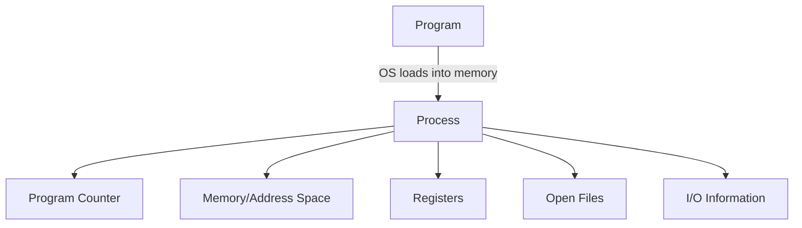
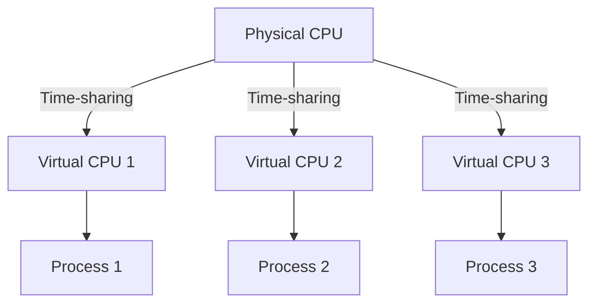
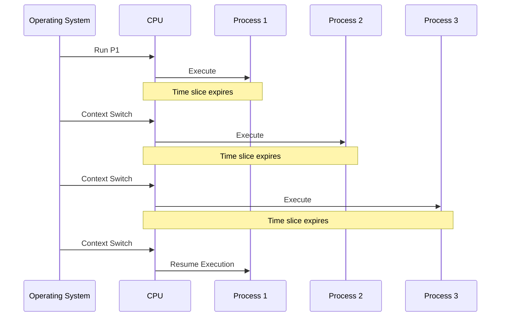
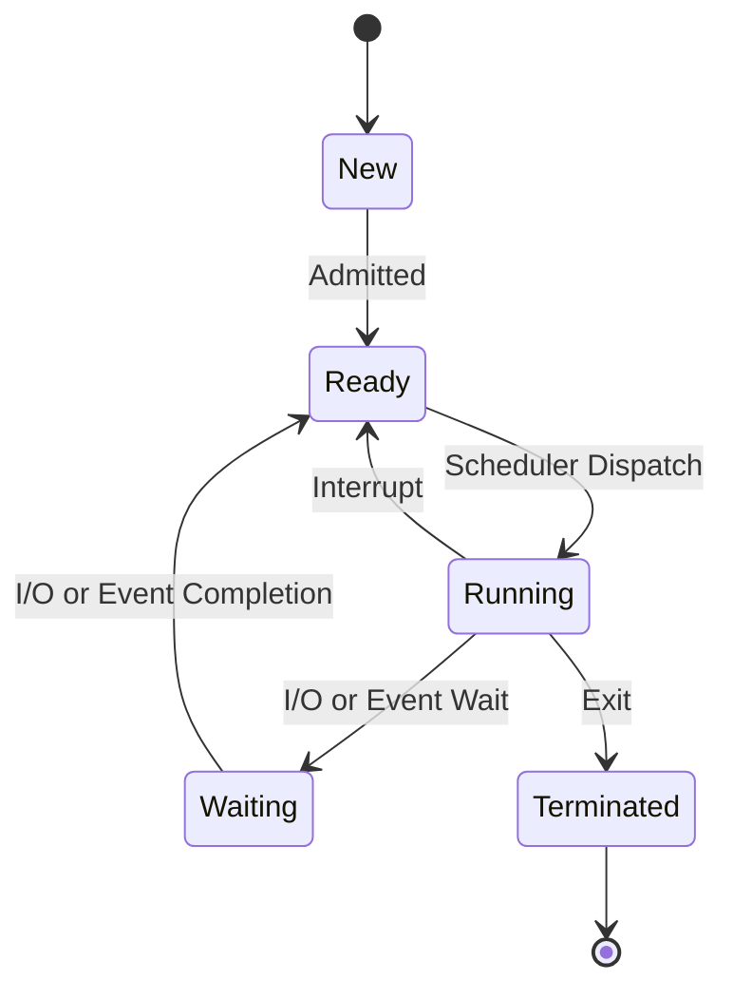
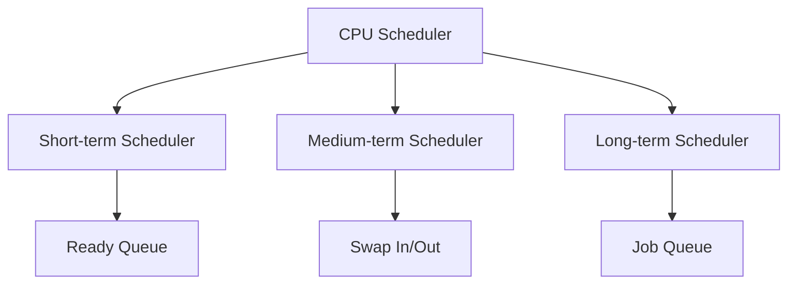
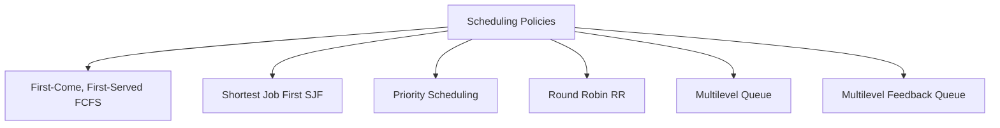
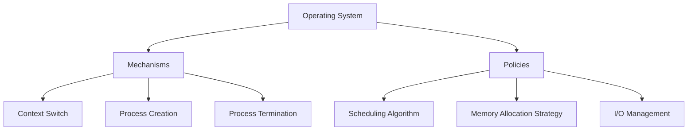
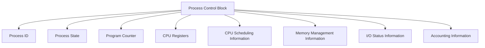

Note: "Markdown Preview Mermaid Support" install extension

# Process Abstraction and CPU Virtualization: A Schematic Overview

## 1. The Process Abstraction

- **Process**: A running instance of a program
- **Components**: Program counter, memory/address space, registers, open files, I/O information

## 2. CPU Virtualization

- **Illusion**: Many virtual CPUs from limited physical CPUs
- **Technique**: Time-sharing

## 3. Time-sharing Mechanism

- **Context Switch**: Saving and restoring process state
- **Time Slice**: Fixed amount of time each process runs

## 4. Process States

- **States**: New, Ready, Running, Waiting, Terminated
- **Transitions**: Controlled by the OS scheduler

## 5. CPU Scheduling

- **Short-term**: Selects which process to execute next
- **Medium-term**: Handles swapping processes between memory and disk
- **Long-term**: Controls which jobs are admitted to the system

## 6. Scheduling Policies

- **Goal**: Optimize various metrics (throughput, response time, fairness)
- **Trade-offs**: Different policies optimize for different scenarios

## 7. Mechanisms vs Policies

- **Mechanisms**: Low-level implementations (how)
- **Policies**: High-level decisions (what)

## 8. Process Control Block (PCB)

- **PCB**: Data structure maintaining all information about a process
- **Usage**: Essential for context switching and process management

