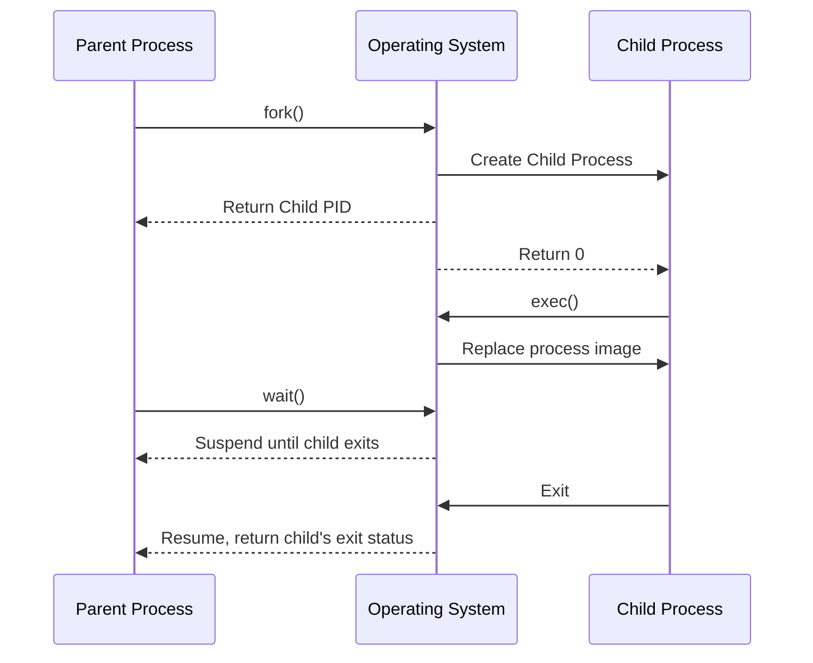

# Fork-Exec Process: Creating and Managing Child Processes

## Sequence Diagram

## Overview

The fork-exec model is a method used by operating systems, particularly Unix-like systems, to create new processes. This document explains the process illustrated in the sequence diagram above.

## Participants

- **Parent Process (P)**: The original process that initiates the creation of a child process.
- **Operating System (OS)**: Manages process creation and execution.
- **Child Process (C)**: The new process created by the parent.

## Process Steps

1. **Fork Call**
   - Parent Process calls `fork()`
   - OS creates a new Child Process, an exact copy of the parent
   - OS returns:
     - To Parent: Child's Process ID (PID)
     - To Child: 0

2. **Exec Call**
   - Child Process calls `exec()`
   - OS replaces the child's process image with a new program

3. **Wait Call**
   - Parent Process calls `wait()`
   - OS suspends the Parent Process until the Child Process exits

4. **Child Execution and Exit**
   - Child Process runs its program
   - When finished, Child Process exits

5. **Parent Resumption**
   - OS resumes the Parent Process
   - OS returns the Child's exit status to the Parent

## Key Concepts

- **Fork**: Creates a new process by duplicating the calling process.
- **Exec**: Replaces the current process image with a new one.
- **Wait**: Allows a parent process to wait for a child process to finish.

## Advantages

- Allows for process creation with inheritance of parent's attributes
- Enables running different programs in child processes
- Provides a mechanism for parent processes to monitor and manage child processes

## Common Use Cases

- Shell command execution
- Server processes spawning worker processes
- Parallel processing in multi-core systems

Understanding this model is crucial for system programming and process management in Unix-like operating systems.
