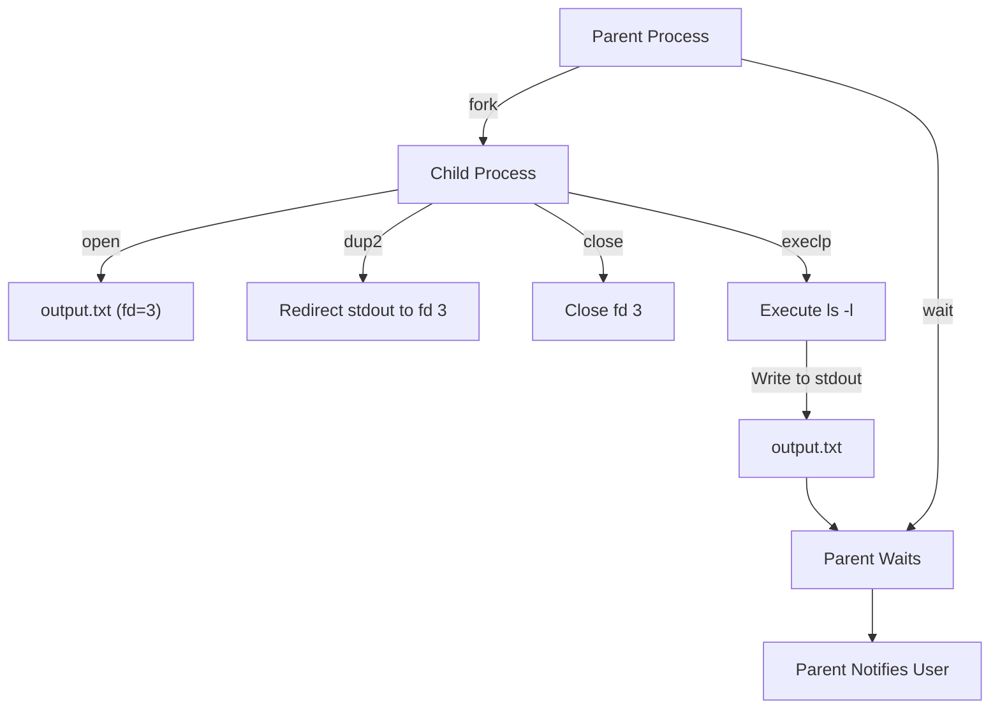

# Redirection in Unix-like Systems: An In-Depth Example

## Introduction

This document provides an in-depth explanation of how redirection works in Unix-like systems, using a specific example of redirecting the output of the `ls` command to a file. We'll explore the underlying mechanisms of file descriptors, process creation, and execution to understand how a child process can set up redirection for a new program without that program needing to be aware of the redirection. Central to this process is the fork-wait-exec pattern, a fundamental concept in Unix-like operating systems.

## The Fork-Wait-Exec Pattern

The fork-wait-exec pattern is a crucial mechanism in Unix-like systems that allows for the creation of new processes and the execution of new programs. This pattern is what makes our redirection example possible. Let's break it down:

1. **Fork**: The parent process creates an exact copy of itself (a child process) using the `fork()` system call.
2. **Exec**: The child process then uses one of the `exec` family of functions (in our case, `execlp()`) to replace its memory image with a new program.
3. **Wait**: The parent process uses the `wait()` system call to wait for the child process to complete.

This pattern allows for a clear separation between process creation and program execution, enabling powerful operations like setting up file descriptors before executing a new program.

## Example Code

Let's examine a C program that demonstrates this redirection process using the fork-wait-exec pattern:

```c
#include <stdio.h>
#include <stdlib.h>
#include <unistd.h>
#include <fcntl.h>
#include <sys/wait.h>

int main() {
    pid_t pid = fork();  // Fork: Create a child process

    if (pid == 0) {
        // Child process
        int fd = open("output.txt", O_WRONLY | O_CREAT | O_TRUNC, 0644);
        dup2(fd, STDOUT_FILENO);
        close(fd);
        execlp("ls", "ls", "-l", NULL);  // Exec: Replace with new program
        exit(1);  // This line is reached only if execlp fails
    } else {
        // Parent process
        wait(NULL);  // Wait: Wait for child to complete
        printf("Child process completed. Check output.txt for the result.\n");
    }

    return 0;
}
```

## Process Visualization

To better understand the flow of this process, including the fork-wait-exec pattern, let's look at an updated flowchart:



## Understanding File Descriptors and Standard Streams

In Unix-like systems, every process has a set of file descriptors representing open files or streams:

- File descriptor 0: standard input (stdin)
- File descriptor 1: standard output (stdout)
- File descriptor 2: standard error (stderr)

When a process writes to stdout, it writes to file descriptor 1.

## Detailed Explanation of the Child Process Steps

### 1. Opening output.txt for Writing

```c
int fd = open("output.txt", O_WRONLY | O_CREAT | O_TRUNC, 0644);
```

This line opens (or creates) `output.txt` for writing and returns a new file descriptor (let's say `fd = 3`).

### 2. Redirecting stdout to output.txt

```c
dup2(fd, STDOUT_FILENO);
```

The `dup2` function duplicates the file descriptor `fd` to `STDOUT_FILENO` (which is file descriptor 1). After this call, file descriptor 1 now refers to `output.txt`.

### 3. Closing the Original File Descriptor

```c
close(fd);
```

We close the original `fd` as it's no longer needed. This prevents resource leaks.

### 4. Executing ls -l

```c
execlp("ls", "ls", "-l", NULL);
```

The `execlp` function replaces the current process image with the new process image of `ls -l`. This is the "exec" part of the fork-wait-exec pattern.

## How ls Writes to output.txt

### ls Doesn't Need to Know About output.txt

The key point here is that the `ls` command writes its output to stdout as it normally would. It doesn't need to know anything about `output.txt`. Because stdout (file descriptor 1) has been redirected to `output.txt`, `ls`'s output automatically goes into that file.

### File Descriptor Table Evolution

To understand this better, let's look at how the file descriptor table changes:

Before `exec`:

| FD | Description      |
|----|------------------|
| 0  | Standard Input   |
| 1  | Redirected to fd |
| 2  | Standard Error   |
| 3  | output.txt       |

After `dup2(fd, STDOUT_FILENO);` and `close(fd);`:

| FD | Description    |
|----|----------------|
| 0  | Standard Input |
| 1  | output.txt     |
| 2  | Standard Error |

After `exec`, the file descriptor table remains the same for the new `ls` process.

## Why This Works: Key Concepts

### The Fork-Wait-Exec Pattern Enables Redirection

The fork-wait-exec pattern is crucial for this redirection process:
- **Fork** creates a new process where we can safely modify file descriptors without affecting the parent.
- **Exec** allows us to replace the process image after we've set up the redirection, ensuring the new program inherits our modified file descriptors.
- **Wait** allows the parent to wait for the child to complete, ensuring proper synchronization.

### File Descriptors Persist Across exec

A crucial aspect of this process is that file descriptors remain open when a new program is executed with `exec`, unless they are explicitly marked to be closed on execution (using the `FD_CLOEXEC` flag).

### Standard Streams Are Just File Descriptors

This example illustrates that standard streams (stdin, stdout, stderr) are simply file descriptors. By manipulating these file descriptors, we can control where a process's input comes from or where its output goes.

## Conclusion

This example demonstrates the power and flexibility of the Unix I/O model and the fork-wait-exec pattern. By understanding and manipulating file descriptors, and leveraging the separation between process creation and program execution, we can change the behavior of programs without modifying their source code. 

The fork-wait-exec pattern allows us to:
1. Create a new process (fork)
2. Set up the environment for the new process, including file descriptors
3. Execute a new program in this prepared environment (exec)
4. Ensure proper synchronization between parent and child processes (wait)

This is the mechanism behind shell redirections like `ls -l > output.txt`, and it's a fundamental concept in Unix-like operating systems.

The `ls` command writes its output to stdout without needing to know about any files. By manipulating file descriptors in the child process before executing `ls`, we effectively tell the operating system to redirect stdout to `output.txt`. This results in the `ls` output being written to `output.txt` transparently.

This redirection process, enabled by the fork-wait-exec pattern, is a prime example of the Unix philosophy of creating small, focused tools that can be combined in powerful ways. By separating the concerns of process creation, environment setup, and program execution, Unix-like systems provide a flexible and powerful environment for both users and programmers.
