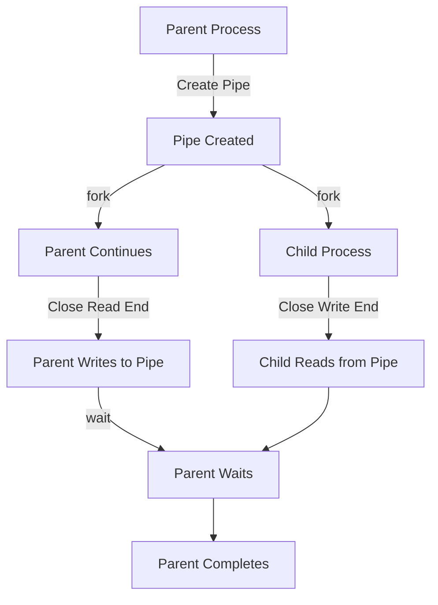

# Inter-Process Communication Using Pipes in Unix-like Systems: An In-Depth Example

## Introduction

This document provides an in-depth explanation of how pipes are used for inter-process communication in Unix-like systems. We'll explore a specific example of a parent process sending a message to a child process using a pipe. Central to this process is the fork-wait-exec pattern, a fundamental concept in Unix-like operating systems, combined with the use of pipes for communication between processes.

## The Fork-Wait-Exec Pattern with Pipes

The fork-wait-exec pattern is crucial in Unix-like systems, allowing for the creation of new processes and the execution of new programs. In this example, we'll see how it's combined with pipes for inter-process communication:

1. **Pipe Creation**: Before forking, the parent process creates a pipe.
2. **Fork**: The parent process creates an exact copy of itself (a child process) using the `fork()` system call. The pipe file descriptors are inherited by the child.
3. **Close Unused Pipe Ends**: Each process closes the pipe end it doesn't need.
4. **Communicate**: The processes use the pipe to communicate.
5. **Wait**: The parent process uses the `wait()` system call to wait for the child process to complete.

This pattern allows for a clear separation between process creation and inter-process communication.

## Example Code

Let's examine a C program that demonstrates pipe communication between parent and child processes:

```c
#include <stdio.h>
#include <stdlib.h>
#include <unistd.h>
#include <sys/wait.h>
#include <string.h>

#define BUFFER_SIZE 1024

int main() {
    int pipefd[2];
    pid_t pid;

    pipe(pipefd);  // Create a pipe

    pid = fork();  // Fork: Create a child process

    if (pid == 0) {
        // Child process
        close(pipefd[1]);  // Close unused write end

        char buffer[BUFFER_SIZE];
        read(pipefd[0], buffer, sizeof(buffer));
        printf("Child received: %s", buffer);

        close(pipefd[0]);
    } else {
        // Parent process
        close(pipefd[0]);  // Close unused read end

        const char *message = "Hello from parent!";
        write(pipefd[1], message, strlen(message));

        close(pipefd[1]);
        wait(NULL);  // Wait: Wait for child to complete

        printf("Parent process completed.\n");
    }

    return 0;
}
```

## Process Visualization

To better understand the flow of this process, including the fork-wait-exec pattern and pipe communication, let's look at a flowchart:



## Understanding Pipes

A pipe is a unidirectional communication channel that can be used for inter-process communication. It has two ends: a read end and a write end. Data written to the write end can be read from the read end.

In Unix-like systems, a pipe is represented by two file descriptors:
- `pipefd[0]`: The read end of the pipe
- `pipefd[1]`: The write end of the pipe

## Detailed Explanation of the Process Steps

### 1. Creating the Pipe

```c
int pipefd[2];
pipe(pipefd);
```

This creates a new pipe and places the file descriptors for the read and write ends in the `pipefd` array.

### 2. Forking the Process

```c
pid_t pid;
pid = fork();
```

This creates a child process that is an exact copy of the parent. Both processes now have access to both ends of the pipe.

### 3. Child Process: Reading from the Pipe

```c
close(pipefd[1]);  // Close unused write end
char buffer[BUFFER_SIZE];
read(pipefd[0], buffer, sizeof(buffer));
printf("Child received: %s", buffer);
close(pipefd[0]);
```

The child process closes the write end of the pipe (which it doesn't need), reads from the pipe into a buffer, prints the received message, and then closes the read end.

### 4. Parent Process: Writing to the Pipe

```c
close(pipefd[0]);  // Close unused read end
const char *message = "Hello from parent!";
write(pipefd[1], message, strlen(message));
close(pipefd[1]);
wait(NULL);
printf("Parent process completed.\n");
```

The parent process closes the read end of the pipe (which it doesn't need), writes a message to the pipe, closes the write end, waits for the child to complete, and then prints a completion message.

## Magic part:
Observe that after a fork(), both the parent and child processes have copies of the same file descriptors, including those associated with the pipe. However, when each process closes a file descriptor, it only affects its own copy; they are not closing the "same" file descriptor in terms of their file descriptor tables.

## Why This Works: Key Concepts

### The Fork-Wait-Exec Pattern Enables Pipe Communication

The fork-wait-exec pattern is crucial for this pipe communication process:
- **Fork** creates a new process that inherits the pipe file descriptors.
- **Wait** allows the parent to wait for the child to complete, ensuring proper synchronization.

### File Descriptors are Inherited Across Fork

When a process forks, the child inherits copies of all the parent's file descriptors. This is why both the parent and child have access to both ends of the pipe after forking.

### Closing Unused Pipe Ends is Important

Each process should close the pipe end it doesn't need. This is important for several reasons:
1. It prevents resource leaks.
2. It allows the reading process to detect end-of-file when the writing process closes its end.
3. It prevents inadvertent data flow in the wrong direction.

## Conclusion

This example demonstrates the power and flexibility of pipes in Unix-like systems, especially when combined with the fork-wait-exec pattern. By creating a pipe before forking, we set up a communication channel that can be used between the parent and child processes.

The fork-wait-exec pattern allows us to:
1. Set up the communication channel (pipe creation)
2. Create a new process that inherits this channel (fork)
3. Use the channel for inter-process communication
4. Ensure proper synchronization between parent and child processes (wait)

This mechanism is fundamental to many more complex forms of inter-process communication in Unix-like systems. It showcases the Unix philosophy of providing simple, flexible tools that can be combined in powerful ways.

Pipes, along with the fork-wait-exec pattern, enable a wide range of inter-process communication scenarios. They allow processes to work together, sharing data and coordinating their actions, which is crucial for building complex, multi-process applications in Unix-like environments.
