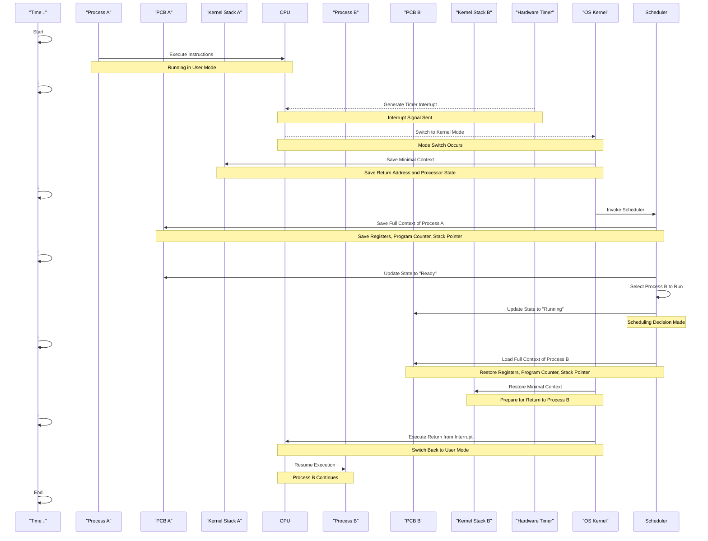

# Context Switch Process: A Comprehensive Guide

## Table of Contents
1. [Introduction](#introduction)
2. [Visual Representation](#visual-representation)
3. [Detailed Step-by-Step Explanation](#detailed-step-by-step-explanation)
4. [Key Components](#key-components)
5. [Summary](#summary)

## Introduction

A context switch is a fundamental operation in multitasking operating systems, allowing multiple processes to share a single CPU efficiently. This guide provides a detailed explanation of the context switch process, its components, and its importance in modern computing, including the role of kernel stacks and process control blocks (PCBs).

## Visual Representation

## Detailed Step-by-Step Explanation

1. Process A Execution
   - Process A is executing in User Mode on the CPU.
   - It has limited privileges, ensuring system security and stability.

2. Timer Interrupt Occurrence
   - The Hardware Timer generates a timer interrupt.
   - This interrupt signals the CPU that it's time to perform scheduling activities.
   - The CPU receives the interrupt signal and prepares to handle it.

3. Mode Switch (User Mode to Kernel Mode)
   - The CPU switches from User Mode to Kernel Mode, elevating its privilege level.
   - This mode switch allows the CPU to execute privileged operations required for handling the interrupt.

4. Saving Minimal Context on Kernel Stack A
   - Upon entering Kernel Mode, the CPU saves a minimal context onto Kernel Stack A associated with Process A.
   - This minimal context typically includes:
     - Return address
     - Processor status register
   - The Kernel Stack ensures that the kernel's operations do not interfere with the user stack.

5. Invoking the Scheduler
   - The OS Kernel invokes the Scheduler to determine which process should run next.
   - The Scheduler begins the context-switching process by saving Process A's state.

6. Saving Full Context of Process A
   - The Scheduler saves the full context of Process A into its Process Control Block (PCB A).
   - The saved context includes:
     - General-purpose registers
     - Program counter (instruction pointer)
     - Stack pointer
     - Processor flags
   - This full context is necessary to resume Process A at a later time without loss of information.

7. Updating Process States
   - The Scheduler updates PCB A:
     - Changes the state from "Running" to "Ready".
   - The Scheduler selects Process B to run next based on the scheduling algorithm.
   - PCB B is updated:
     - Changes the state from "Ready" to "Running".

8. Loading Full Context of Process B
   - The Scheduler loads the full context of Process B from PCB B.
   - This includes restoring:
     - General-purpose registers
     - Program counter
     - Stack pointer
     - Processor flags

9. Restoring Minimal Context from Kernel Stack B
   - The OS Kernel prepares to return control to Process B.
   - It uses Kernel Stack B to restore the minimal context necessary for the return from interrupt.

10. Return from Interrupt
    - The OS Kernel executes a Return from Interrupt instruction.
    - This instruction performs:
      - Restoring the processor status.
      - Switching the CPU back to User Mode.
      - Resuming execution at the program counter of Process B.

11. Process B Execution
    - Process B resumes execution in User Mode.
    - It continues processing its instructions, unaware of the context switch.

## Key Components

### Process Control Block (PCB)
- A critical data structure in the OS kernel.
- Contains process-specific information:
  - Process State: Running, Ready, Blocked, etc.
  - CPU Registers: General-purpose registers saved during context switches.
  - Program Counter: Address of the next instruction to execute.
  - Stack Pointers: User and kernel stack pointers.
  - Memory Management Info: Page tables, segment tables.
  - Accounting Data: CPU usage, process ID.

### Kernel Stack
- A dedicated stack used by the kernel for each process.
- Stores minimal context information during interrupts and system calls.
- Ensures that kernel operations do not interfere with user-mode stacks.
- Helps maintain separate execution contexts for each process in kernel mode.

### Scheduler
- A component of the OS responsible for process scheduling.
- Implements algorithms to decide which process runs next (e.g., Round Robin, Priority Scheduling).
- Manages context switches by interacting with PCBs.

### OS Kernel
- The core part of the operating system.
- Manages system resources and hardware.
- Handles interrupts, system calls, and mode transitions.
- Uses kernel stacks and PCBs for managing processes.

### CPU Modes
- User Mode:
  - Limited privileges.
  - Runs user applications.
  - Restricted access to critical system resources.
- Kernel Mode:
  - Full system access.
  - Runs OS kernel code.
  - Can execute privileged instructions.

### Hardware Timer
- Generates periodic timer interrupts.
- Allows the OS to perform regular scheduling.
- Prevents any single process from monopolizing the CPU.

### Context Switch
- The process of storing and restoring the state of a CPU so that execution can be resumed from the same point at a later time.
- Involves saving the context of the currently running process and loading the context of the next process.
- Essential for multitasking and efficient CPU utilization.

## Summary

The context switch process is vital for multitasking operating systems, enabling efficient CPU sharing among multiple processes. By carefully managing transitions between processes through the use of Process Control Blocks, Kernel Stacks, the OS Kernel, and the Scheduler, operating systems maintain a balance between performance and security.

Key aspects of the context switch include:

1. Saving and Restoring Contexts:
   - Minimal context is saved to the Kernel Stack during interrupts.
   - Full context is saved to and loaded from the PCB during context switches.

2. Kernel Stack Usage:
   - Provides a separate stack space for kernel operations per process.
   - Prevents interference with user-mode stacks.
   - Used during system calls and interrupt handling.

3. Process State Management:
   - Processes transition between states: Running, Ready, Blocked.
   - The Scheduler updates these states in the PCBs.

4. Mode Switching:
   - Transitions between User Mode and Kernel Mode protect system integrity.
   - Ensures that only trusted kernel code can execute privileged instructions.

5. Hardware Timer Interrupts:
   - Regular interrupts ensure the OS can perform scheduling decisions.
   - Helps in fair CPU time allocation among processes.

Understanding the context switch process, including the roles of the Kernel Stack and PCB, is fundamental to grasping how modern operating systems achieve concurrency, maintain process isolation, and manage system resources effectively.
