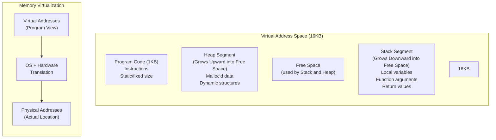

# Address Space: OS Memory Virtualization

## Visual Representation

## The Address Space Abstraction

### Core Concept
The address space is an OS abstraction that provides each process with its own view of memory, creating the illusion of private memory ownership. This abstraction hides the complexity of physical memory management from programs.

### Key Components

1. **Program Code (Code Segment)**
   - Located at the bottom (0KB in example)
   - Contains program instructions
   - Static size (1KB in example)
   - Fixed position due to unchanging size

2. **Heap Segment**
   - Starts after code (1KB)
   - Grows downward
   - Used for dynamic memory allocation
   - Managed through:
     - `malloc()` in C
     - `new` in C++/Java
   - Contains dynamic data structures

3. **Stack Segment**
   - Starts at top of address space (16KB)
   - Grows upward
   - Contains:
     - Local variables
     - Function arguments
     - Return values
     - Call chain tracking

### Memory Virtualization

#### The Challenge
How does the OS provide each process with:
- A private address space
- Potentially large memory space (32-bit or 64-bit)
- Protection from other processes
- Efficient memory utilization

#### The Solution
1. **Address Translation**
   - Virtual addresses (process view) → Physical addresses (actual location)
   - Example: Process A's load from address 0 might actually access physical address 320KB
   - Transparent to the running program
   
2. **Implementation Requirements**
   - OS support for memory management
   - Hardware support for address translation
   - Coordination between OS and hardware

### Design Considerations

1. **Growth Management**
   - Stack and heap placed at opposite ends
   - Allows both to grow without immediate collision
   - Free space between them acts as growth buffer

2. **Memory Protection**
   - Each process gets its own virtual address space
   - Physical memory access is mediated by OS
   - Prevents processes from accessing each other's memory

3. **Flexibility**
   - 16KB example is simplified for illustration
   - Real systems use much larger spaces (32-bit or 64-bit)
   - Layout is conventional but can be modified

## Historical Impact
This abstraction solved several critical problems in early operating systems:
- Memory protection between processes
- Program relocation
- Memory fragmentation
- Efficient memory utilization

The address space abstraction remains fundamental to modern computing, enabling multi-process systems, memory protection, and efficient memory utilization.
