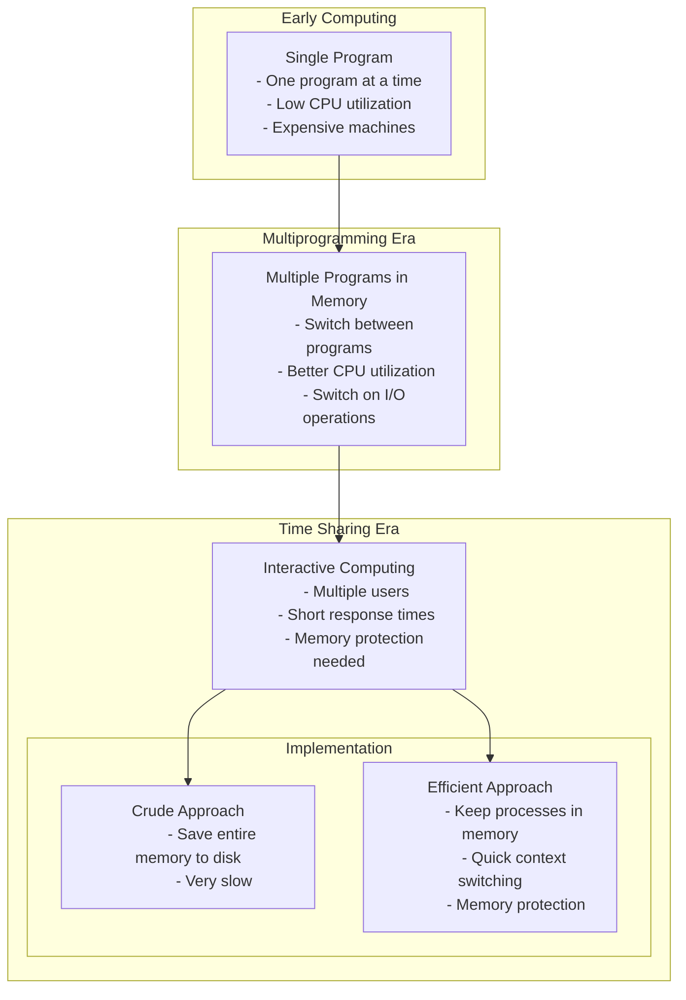

```mermaid
flowchart TD
    subgraph Early["Early Computing"]
        Single["Single Program
        - One program at a time
        - Low CPU utilization
        - Expensive machines"]
    end

    subgraph Multi["Multiprogramming Era"]
        MultiProg["Multiple Programs in Memory
        - Switch between programs
        - Better CPU utilization
        - Switch on I/O operations"]
    end

    subgraph TimeShare["Time Sharing Era"]
        Interactive["Interactive Computing
        - Multiple users
        - Short response times
        - Memory protection needed"]
        
        subgraph Implementation
            Crude["Crude Approach
            - Save entire memory to disk
            - Very slow"]
            Efficient["Efficient Approach
            - Keep processes in memory
            - Quick context switching
            - Memory protection"]
        end
    end

    Single --> MultiProg
    MultiProg --> Interactive
    Interactive --> Crude
    Interactive --> Efficient
```
