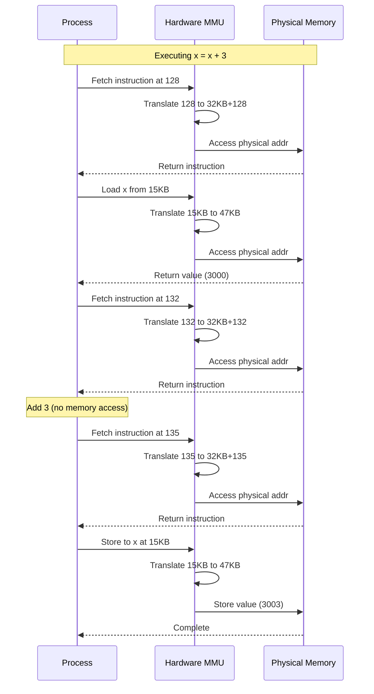

# Address Translation and Memory Virtualization

## The Problem: A Simple Example

Let's examine a simple piece of code and understand how address translation works in practice:

```c
void func() {
    int x = 3000; // located in stack
    x = x + 3;  // the moment you access any memory within a program, address translation take a place 
}
```

Assuming, x = x+3; this compiles to x86 assembly:

```asm
128: movl 0x0(%ebx), %eax ;load 0+ebx into eax
132: addl $0x03, %eax     ;add 3 to eax register
135: movl %eax, 0x0(%ebx) ;store eax back to mem
```

## Memory Organization and Layout

```mermaid
graph TD
    subgraph "Virtual Memory (Process View)"
        V16[16KB Top]
        V15[15KB Stack: x=3000]
        V14[14KB Free Space]
        V4[4KB Heap]
        V1[Program Code: 128-135]
        V0[0KB Bottom]
        
        V16 --> V15 --> V14 --> V4 --> V1 --> V0
        
        style V15 fill:#f9f,stroke:#333
        style V1 fill:#9ff,stroke:#333
    end

    subgraph "Physical Memory (Reality)"
        P64[64KB]
        P48[48KB Not in use]
        P32[32KB Relocated Process]
        P16[16KB Operating System]
        P0[0KB]
        
        P64 --> P48 --> P32 --> P16 --> P0
        
        style P32 fill:#9f9,stroke:#333
        style P16 fill:#ff9,stroke:#333
    end
```



## Memory Access Sequence



## Understanding Memory Access and Translation

From the program's perspective, these memory accesses occur:

1. **Instruction Fetches:**
   - Fetch at address 128
   - Fetch at address 132
   - Fetch at address 135

2. **Data Accesses:**
   - Load from address 15KB (value of x)
   - Store to address 15KB (updated x)

### The Translation Challenge

The program believes:
- Its address space starts at 0
- Grows to maximum of 16KB
- All memory references within these bounds
- Code is at address 128
- Variable x is at address 15KB

The reality is:
- OS occupies first 16KB of physical memory
- Process is relocated to 32KB
- Each address needs translation:
  - Virtual address 0 → Physical address 32KB
  - Virtual address 15KB → Physical address 47KB


## Key Points

1. **Process Perspective**
   - Sees contiguous address space from 0 to 16KB
   - Makes memory references within this range
   - Unaware of physical location

2. **OS Requirements**
   - Must run multiple programs
   - Must protect memory spaces
   - Needs to relocate processes
   - Must maintain illusion for each process

3. **Hardware Support**
   - Translates every memory access
   - Must be efficient (happens frequently)
   - Maintains transparency
   - Enables protection

4. **Benefits**
   - Memory virtualization
   - Process isolation
   - Protection mechanisms
   - Efficient memory utilization

This mechanism creates a perfect illusion: the process believes it owns all memory from 0 to 16KB, while actually running elsewhere in physical memory. The hardware and OS work together through address translation to maintain this illusion efficiently and transparently.
