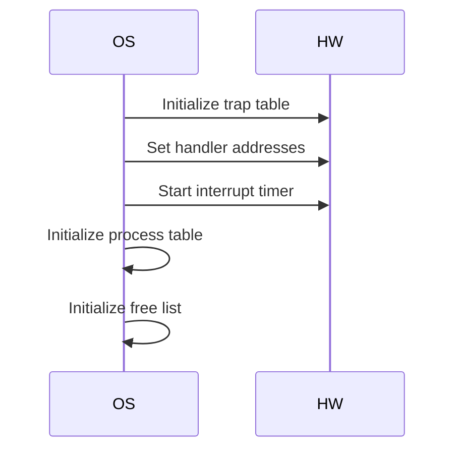
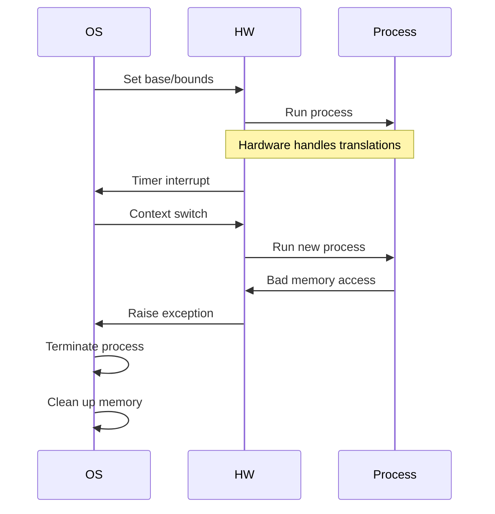

# Operating System Issues in Base and Bounds Memory Management

## 1. Memory Management Responsibilities

### Process Creation
- OS must find space for new address space
- Given assumptions:
  - Each address space < physical memory
  - Initially, all same size (variable sizes handled in future)
- Process:
  1. Search for free memory slot
  2. Mark slot as used
  3. Initialize process structures

### Process Termination
- Reclaim process memory
- Return slot to free list
- Clean up associated data structures
- Happens on:
  1. Graceful exit
  2. Forced termination (misbehavior)

## 2. Context Switch Management

### Why Needed?
- Only one base/bounds pair per CPU
- Each process has different physical location
- Values must change on every switch

### Context Switch Steps
1. **Saving State**
   - Save current base/bounds to process structure/PCB
   - Save other process state

2. **Restoring State**
   - Load new process's base/bounds
   - Restore other process state
   - Process resumes, unaware of translation

### Memory Movement
When process is stopped:
1. OS can move address space
2. Copy memory to new location
3. Update saved base register
4. Process remains unaware when resumed

## 3. Exception Handler Management

### Handler Installation (Boot Time)
- Install system call handler
- Install timer handler
- Install illegal memory access handler
- Install illegal instruction handler
- Set up interrupt timer

### Handler Types
1. **Memory Violation**
   - Out-of-bounds access
   - Usually terminates process

2. **Privileged Instruction**
   - Illegal operation attempt
   - Also typically fatal

### OS Response
- Generally hostile to violations
- Protects system integrity
- Typically terminates offending process

## 4. Hardware/OS Timeline

### Boot Time

### Runtime

## 5. Limited Direct Execution
- OS sets up hardware appropriately
- Process runs directly on CPU
- Hardware handles translations
- OS only involved in:
  1. Context switches
  2. Exceptions
  3. Process management

## 6. OS Requirements Summary

| Requirement | Purpose | Notes |
|------------|---------|-------|
| Memory management | Resource allocation | Handle process memory needs |
| Base/bounds management | Context switching | Save/restore per process |
| Exception handling | Protection | Handle violations |
| Process tracking | System management | Maintain process info |

The OS provides the management layer that makes base and bounds hardware features useful for process isolation and memory virtualization.

