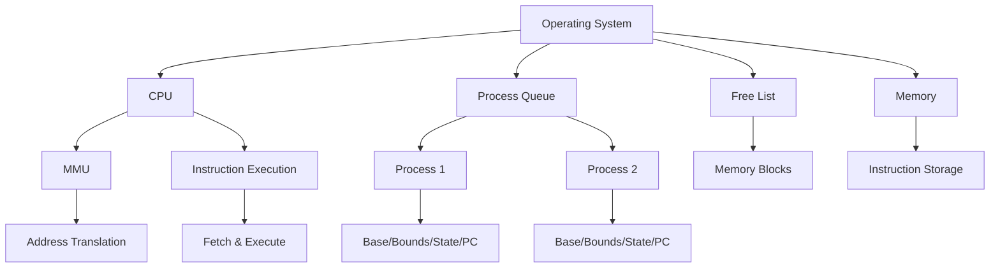

# Operating System Simulation in Rust (Full Code)

This Rust code provides a simplified simulation of an operating system with basic features like context switching and memory management. It demonstrates how processes are scheduled, memory is allocated and reclaimed, and the CPU executes instructions while enforcing memory protection through the Memory Management Unit (MMU).

## Our simulation


## Code

```rust
use std::collections::VecDeque;

/// Memory Management Unit (MMU)
#[derive(Debug)]
struct MMU {
    base_register: usize,
    bounds_register: usize,
}

impl MMU {
    fn new() -> Self {
        MMU {
            base_register: 0,
            bounds_register: 0,
        }
    }

    fn update_registers(&mut self, base: usize, bounds: usize) {
        self.base_register = base;
        self.bounds_register = bounds;
    }

    fn translate_address(&self, virtual_addr: usize) -> Result<usize, &'static str> {
        let physical_addr = virtual_addr + self.base_register;
        if physical_addr < self.base_register || physical_addr >= self.bounds_register {
            return Err("Memory access violation: address out of bounds");
        }
        Ok(physical_addr)
    }
}

/// Simulated CPU Instructions
#[derive(Debug, Clone)]
enum Instruction {
    Load(usize),
    Store(usize),
    Add(usize),
    Sub(usize),
    Jump(usize),
}

/// Memory Simulation
struct Memory {
    storage: Vec<Option<Instruction>>, // Physical memory
}

impl Memory {
    fn new(size: usize) -> Self {
        Memory {
            storage: vec![None; size],
        }
    }

    fn store_instruction(&mut self, addr: usize, instruction: Instruction) -> Result<(), &'static str> {
        if addr >= self.storage.len() {
            return Err("Memory address out of bounds");
        }
        self.storage[addr] = Some(instruction);
        Ok(())
    }

    fn fetch_instruction(&self, addr: usize) -> Option<Instruction> {
        if addr >= self.storage.len() {
            None
        } else {
            self.storage[addr].clone()
        }
    }
}

/// Process State
#[derive(Debug, PartialEq)]
enum ProcessState {
    Ready,
    Running,
    Terminated,
}

/// Process
struct Process {
    name: String,
    base: usize,
    bounds: usize,
    state: ProcessState,
    program_counter: usize, // Tracks the next instruction to execute
}

impl Process {
    fn new(name: &str, size: usize) -> Self {
        Process {
            name: name.to_string(),
            base: 0,
            bounds: size,
            state: ProcessState::Ready,
            program_counter: 0,
        }
    }
}

/// CPU with MMU
struct CPU {
    id: usize,
    mmu: MMU,
}

impl CPU {
    fn new(id: usize) -> Self {
        CPU { id, mmu: MMU::new() }
    }

    fn run_process(&mut self, process: &mut Process, memory: &Memory) {
        println!("\nCPU {} is switching to {}", self.id, process.name);
        println!("Setting MMU: base={}, bounds={}", process.base, process.bounds);

        self.mmu.update_registers(process.base, process.bounds);
        process.state = ProcessState::Running;

        let time_slice = 2; // Simulate a time slice of 2 instructions
        let mut executed_instructions = 0;

        while let Ok(physical_addr) = self.mmu.translate_address(process.program_counter) {
            if let Some(instruction) = memory.fetch_instruction(physical_addr) {
                process.program_counter += 1; // Advance the program counter
                match self.execute_instruction(&instruction) {
                    Ok(_) => {
                        executed_instructions += 1;
                        if executed_instructions == time_slice {
                            println!(
                                "CPU {}: Time slice expired for process {}",
                                self.id, process.name
                            );
                            process.state = ProcessState::Ready;
                            return; // Context switch
                        }
                    }
                    Err(e) => {
                        println!(
                            "CPU {}: Exception in process {}: {}",
                            self.id, process.name, e
                        );
                        process.state = ProcessState::Terminated;
                        return;
                    }
                }
            } else {
                println!(
                    "CPU {}: Invalid memory access for process {}",
                    self.id, process.name
                );
                process.state = ProcessState::Terminated;
                return;
            }
        }

        process.state = ProcessState::Terminated;
        println!("Process {} completed successfully", process.name);
    }

    fn execute_instruction(&mut self, instruction: &Instruction) -> Result<(), &'static str> {
        match instruction {
            Instruction::Load(addr) => {
                let physical_addr = self.mmu.translate_address(*addr)?;
                println!("Loading from virtual addr {} (physical: {})", addr, physical_addr);
            }
            Instruction::Store(addr) => {
                let physical_addr = self.mmu.translate_address(*addr)?;
                println!("Storing to virtual addr {} (physical: {})", addr, physical_addr);
            }
            Instruction::Add(addr) => {
                let physical_addr = self.mmu.translate_address(*addr)?;
                println!("Adding value from virtual addr {} (physical: {})", addr, physical_addr);
            }
            Instruction::Sub(addr) => {
                let physical_addr = self.mmu.translate_address(*addr)?;
                println!("Subtracting value from virtual addr {} (physical: {})", addr, physical_addr);
            }
            Instruction::Jump(addr) => {
                let physical_addr = self.mmu.translate_address(*addr)?;
                println!("Jumping to virtual addr {} (physical: {})", addr, physical_addr);
            }
        }
        Ok(())
    }
}

/// Operating System
struct OS {
    cpus: Vec<CPU>,
    free_list: Vec<(usize, usize)>,
    process_queue: VecDeque<Process>,
    memory: Memory, // Simulated physical memory
}

impl OS {
    fn new(cpu_count: usize, total_memory: usize) -> Self {
        let cpus = (0..cpu_count).map(CPU::new).collect();
        OS {
            cpus,
            free_list: vec![(0, total_memory)],
            process_queue: VecDeque::new(),
            memory: Memory::new(total_memory),
        }
    }

    fn allocate_memory(&mut self, size: usize) -> Option<(usize, usize)> {
        for (i, &(start, end)) in self.free_list.iter().enumerate() {
            if end - start >= size {
                self.free_list.remove(i);
                let allocated = (start, start + size);
                if end > start + size {
                    self.free_list.push((start + size, end));
                }
                return Some(allocated);
            }
        }
        None
    }

    fn reclaim_memory(&mut self, base: usize, bounds: usize) {
        println!("Reclaiming memory: base={}, bounds={}", base, bounds);
        self.free_list.push((base, bounds));
        self.free_list.sort();
    }

    fn add_process(&mut self, mut process: Process, instructions: Vec<Instruction>) {
        let size = process.bounds;
        if let Some((base, _)) = self.allocate_memory(size) {
            process.base = base;
            process.bounds = base + size;

            for (i, instruction) in instructions.into_iter().enumerate() {
                if let Err(e) = self.memory.store_instruction(base + i, instruction) {
                    println!("Error storing instruction: {}", e);
                }
            }

            println!(
                "Allocated process {} at base={}, bounds={}",
                process.name, process.base, process.bounds
            );
            self.process_queue.push_back(process);
        } else {
            println!("Not enough memory to allocate for process {}", process.name);
        }
    }

    fn run(&mut self) {
        while !self.process_queue.is_empty() {
            let mut process = self.process_queue.pop_front().unwrap();

            if process.state == ProcessState::Terminated {
                continue;
            }

            let cpu = &mut self.cpus[0]; // Use the first CPU
            cpu.run_process(&mut process, &self.memory);

            if process.state == ProcessState::Ready {
                self.process_queue.push_back(process); // Re-queue the process for another time slice
            } else if process.state == ProcessState::Terminated {
                println!("OS: Process {} finished", process.name);
                self.reclaim_memory(process.base, process.bounds);
            }
        }

        println!("\nAll processes completed or terminated.");
    }
}

fn main() {
    println!("Starting simulation with context switching and memory simulation...\n");

    let mut os = OS::new(1, 64 * 1024); // Single CPU

    // Process 1 instructions
    let process1_instructions = vec![
        Instruction::Load(128),
        Instruction::Add(256),
        Instruction::Store(512),
    ];
    let process1 = Process::new("Process-1", 16 * 1024);

    // Process 2 instructions
    let process2_instructions = vec![
        Instruction::Load(0),
        Instruction::Store(16383),
        Instruction::Load(16384), // At bounds - should fail
    ];
    let process2 = Process::new("Process-2", 16 * 1024);

    // Add processes to OS
    os.add_process(process1, process1_instructions);
    os.add_process(process2, process2_instructions);

    os.run();
}
```

## Simulation Flow

1. The `main` function sets up the simulation by creating an instance of the `OS` with a single CPU and 64KB of memory.
2. Two processes (`Process-1` and `Process-2`) are defined with their respective instructions and added to the OS.
3. The simulation starts by calling `os.run()`.
4. The OS schedules processes from the process queue.
5. The CPU executes instructions for each process based on a time slice.
6. The MMU translates virtual addresses to physical addresses and checks for memory access violations.
7. Processes can be context-switched when their time slice expires.
8. When a process terminates, its memory is reclaimed by the OS.

The simulation output shows the execution of instructions, memory translations, and process state transitions.

This simplified simulation provides insights into how an operating system manages processes, memory, and CPU execution. It showcases concepts like virtual memory, context switching, and process scheduling, which are fundamental to modern operating systems.

