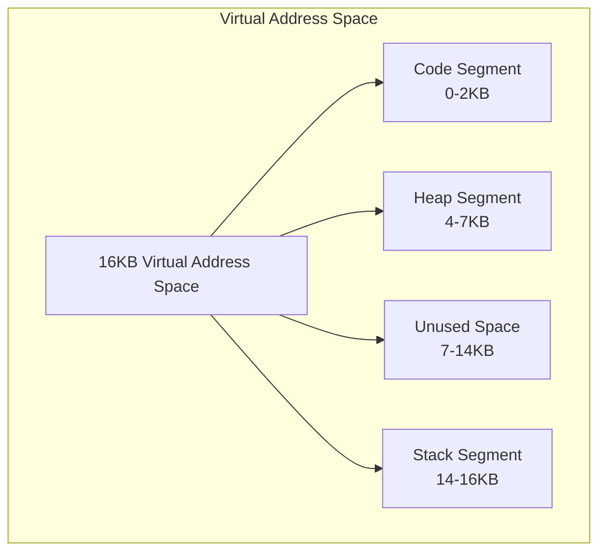
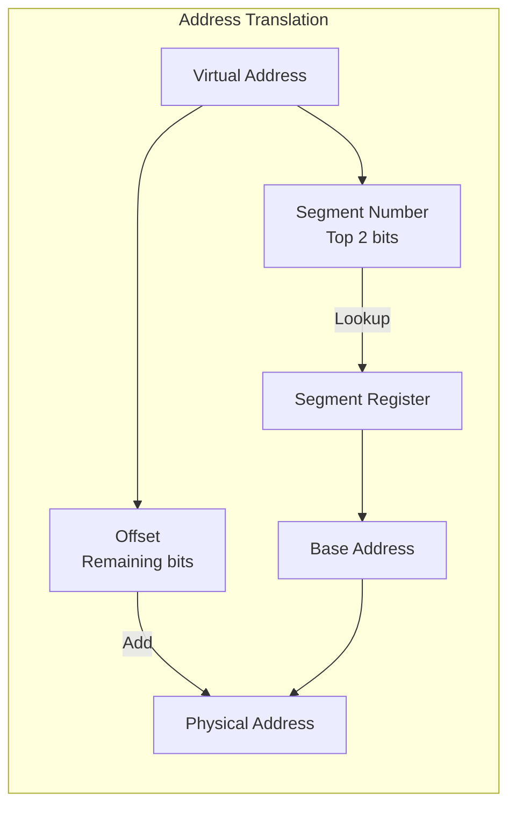
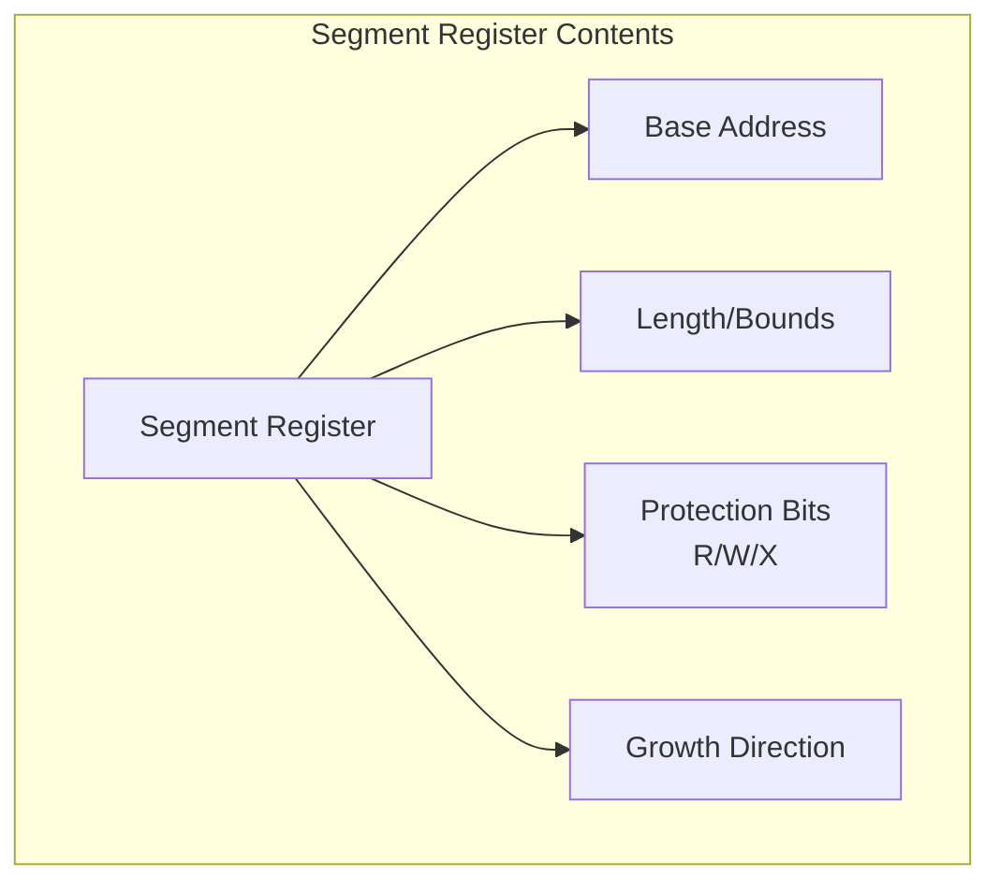

# Memory Segmentation: Comprehensive Overview

## 1. Basic Concept of Segmentation

Segmentation solves the problem of managing large address spaces by dividing them into logical segments. Instead of treating memory as one large, continuous array, segmentation breaks it into three main logical units: code, heap, and stack.



Key advantages of this approach:
- Efficient memory utilization
- Support for sparse address spaces
- Better protection through segment-level access control
- Enables sharing of code segments between processes

## 2. Address Translation Process

Segmentation hardware uses base and bounds registers for each segment. The translation process involves:



Translation steps:
1. Extract segment number (top bits)
2. Extract offset (remaining bits)
3. Check segment bounds
4. Add base address to offset
5. Generate physical address

## 3. Segment Register Structure

Each segment has associated hardware registers containing:



Example segment register values:
```
Segment   Base    Size    Protection   Growth
Code      32KB    2KB     R-X         Forward
Heap      34KB    3KB     RW-         Forward
Stack     28KB    2KB     RW-         Backward
```


## Summary

Segmentation provides:
- Logical separation of memory
- Efficient memory utilization
- Protection mechanisms

However, it also introduces:
- External fragmentation
- Compaction overhead
- Complex memory management

The trade-offs between these benefits and challenges led to the development of paging and hybrid approaches in modern systems.
