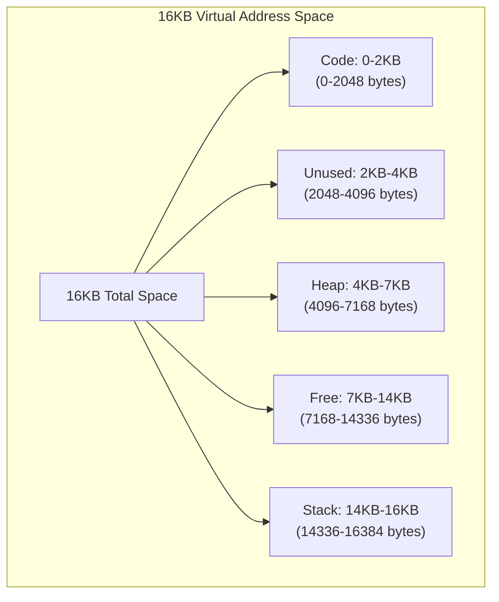
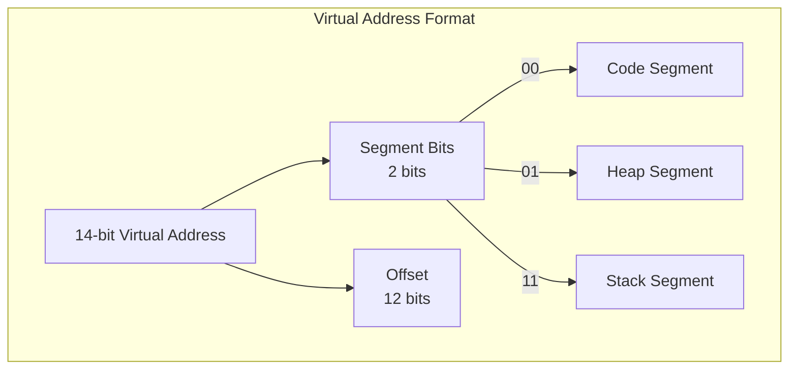
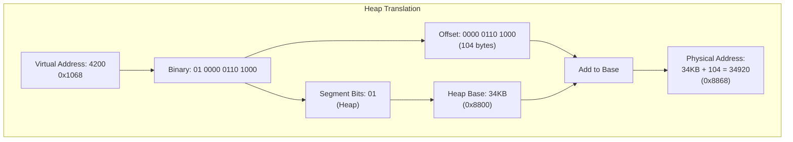
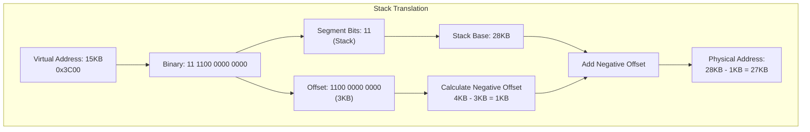
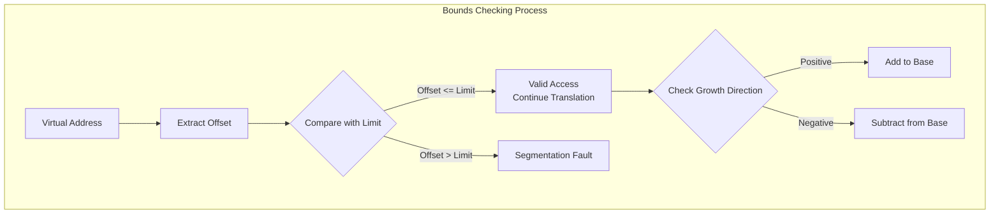
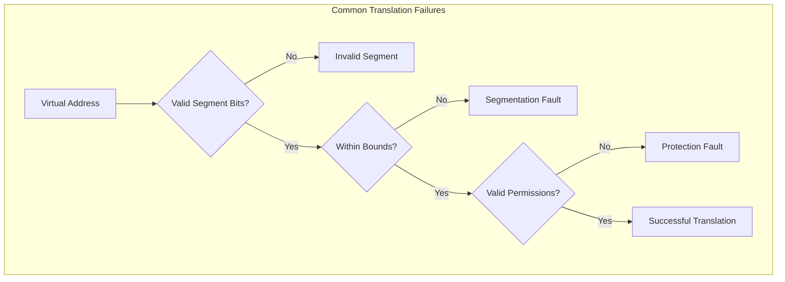

# Address Translation in Segmentation: Heap and Stack Examples



## 1. Basic Translation Structure



## 2. Heap Address Translation Example

Let's walk through translating virtual address 4200 (heap access):



Calculation Steps:
1. Virtual Address 4200 (0x1068)
2. Top 2 bits (01) indicate heap segment
3. Remove segment start (4200 - 4096 = 104)
4. Add to heap base (34KB + 104 = 34920)

## 3. Stack Address Translation

Stack is special because it grows downward. Let's translate address 15KB (stack access):



Stack Translation Steps:
1. Virtual Address 15KB (0x3C00)
2. Top 2 bits (11) indicate stack segment
3. Calculate negative offset from max size
4. Subtract from stack base

## 4. Bounds Checking



Example Segment Register Values:
```
Segment   Base    Limit    Growth    Virtual Range
Heap      34KB    3KB     Forward   4KB - 7KB
Stack     28KB    2KB     Backward  14KB - 16KB
```

## 5. Translation Examples

### Heap Access Example (4200):
```
Virtual Address:  4200 (0x1068)
Segment Bits:     01 (Heap)
Offset:           104 bytes
Physical Address: Base + Offset
                 34KB + 104 = 34920
Bounds Check:     104 < 3KB (valid)
```

### Stack Access Example (15KB):
```
Virtual Address:  15KB (0x3C00)
Segment Bits:     11 (Stack)
Original Offset:  3KB
Negative Offset:  1KB (4KB - 3KB)
Physical Address: Base - Negative Offset
                 28KB - 1KB = 27KB
Bounds Check:     1KB < 2KB (valid)
```

## 6. Common Translation Errors



Common errors include:
- Accessing beyond segment limits
- Using invalid segment numbers
- Violating segment permissions
- Not accounting for growth direction
