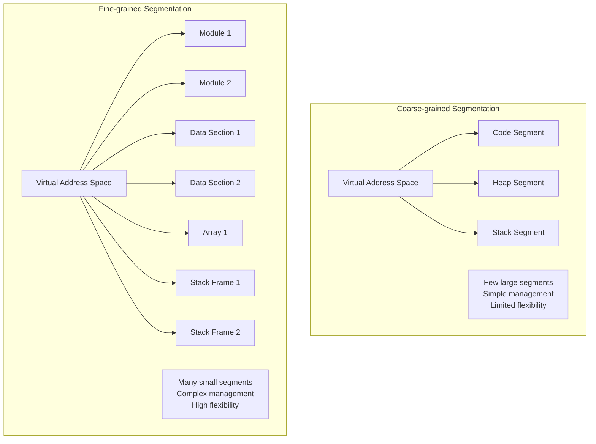
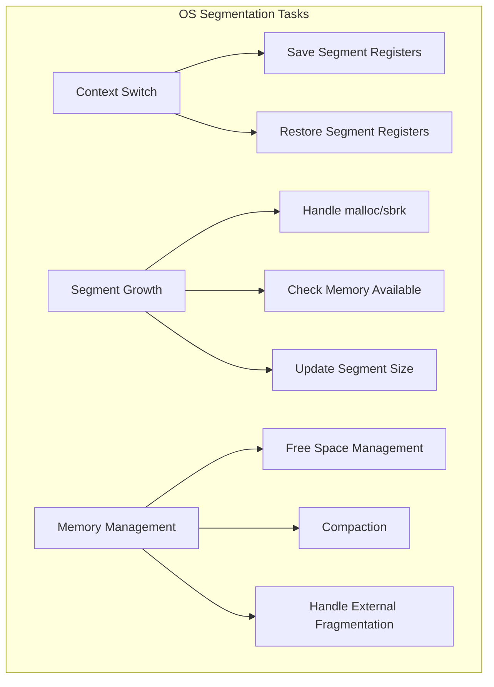
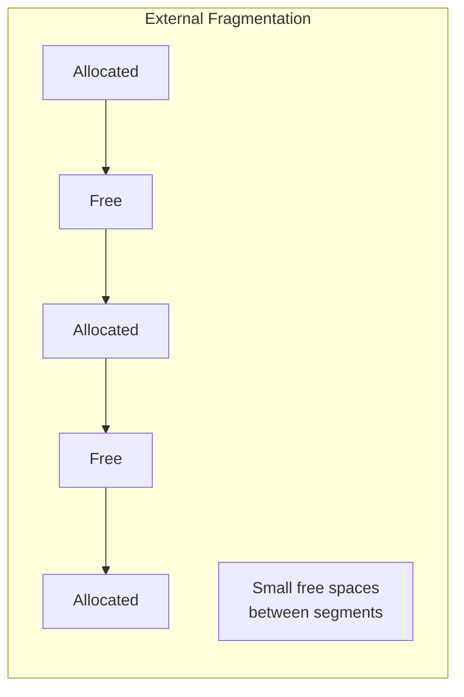

# Advanced Segmentation Concepts

## 1. Fine-grained vs Coarse-grained Segmentation

### Coarse-grained Segmentation
- Uses few, large segments (typically code, heap, stack)
- Benefits:
  * Simple hardware requirements
  * Less management overhead
  * Straightforward address translation
- Limitations:
  * Less flexible memory utilization
  * Potential internal fragmentation
  * Limited sharing granularity

### Fine-grained Segmentation (e.g., Multics)
- Uses many smaller segments
- Benefits:
  * Better memory utilization
  * Fine-grained sharing
  * More flexible protection
- Challenges:
  * Requires segment table in memory
  * More complex management
  * Higher overhead for translation

## 2. OS Support Requirements

### Memory Management Challenges

1. External Fragmentation
   - Problem: Memory becomes fragmented over time
   - Solutions:
     * Best-fit allocation
     * Compaction
     * Buddy allocation

2. Compaction Process:
3. Free Space Management

## Summary of OS Responsibilities
1. Process Management:
   - Save/restore segment registers during context switches
   - Handle process creation and termination

2. Memory Management:
   - Allocate physical memory for segments
   - Handle segment growth requests
   - Manage free space
   - Perform compaction when necessary

3. Protection:
   - Set up protection bits
   - Handle protection violations
   - Manage shared segments

4. Error Handling:
   - Handle segmentation violations
   - Manage out-of-memory conditions
   - Deal with invalid segment accesses
